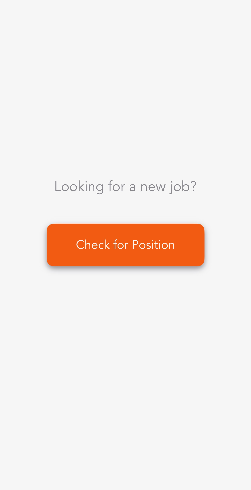
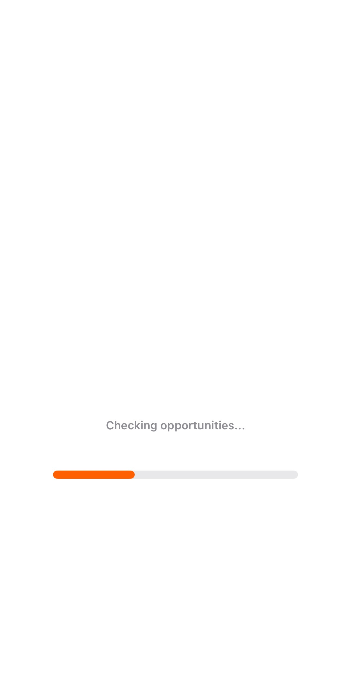
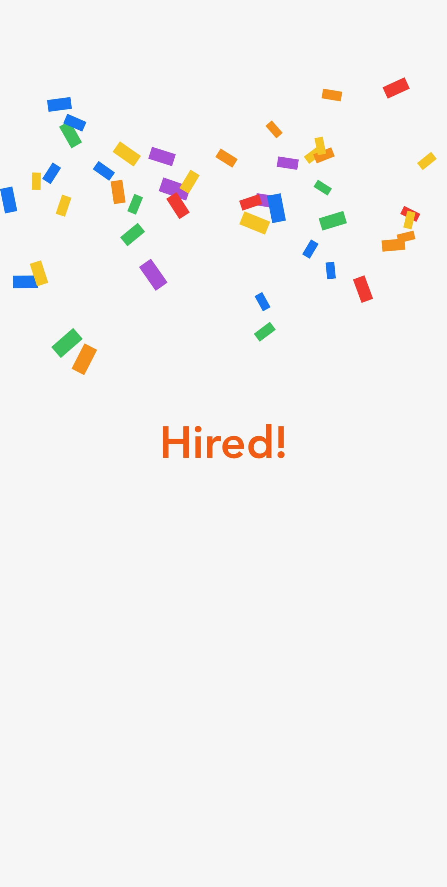

```markdown
# Hired

A playful SwiftUI simulation of the job application process. Experience a series of status updates as your application is processed, culminating in a celebratory "Hired!" message with confetti.

This project demonstrates:
- **SwiftUI** for a clean, declarative UI
- **Animations** (fade effects, progress bar transitions, confetti, etc.)
- **State management** with SwiftUI's @State properties
- **Sequential status updates** to simulate a real job application process
- **Celebratory visuals** when the process completes

---

## Features

- **Interactive button** to start the job search process
- **Sequential status messages** that mimic checking positions, verifying credentials, and matching roles
- **Progress bar** that visually represents the progress of your job application
- **Hired! message** displayed with a scale transition and confetti effect upon completion
- **Smooth transitions** for a polished user experience

---

## Installation

1. **Clone** the repository:
   ```bash
   git clone https://github.com/brzezinskisebastian/Hired.git
   ```
2. **Open** the project in Xcode:
   - Double-click Hired.xcodeproj (or open via Xcode → File → Open).
3. **Run** the app on a simulator or real device (iOS 16+ recommended).

---

## Screenshots

  


---

## Roadmap / Possible Improvements

- **Enhanced animations for even smoother transitions
- **Localization for affirmations (English, Polish, etc.)
- **Dynamic background changes to reflect different moods
- **Integration with real job search APIs for a more realistic experience

---

## License

This project is released under the [MIT License](LICENSE).  
Feel free to modify and distribute as you wish.

---

## Author

**Sebastian Brzeziński**  
- [Personal Page](https://sebastianbrzezinski.pl) 
- [GitHub Profile](https://github.com/brzezinskisebastian)  
- [LinkedIn](https://www.linkedin.com/in/sebastian-brzeziński-a9a142144/)
```
